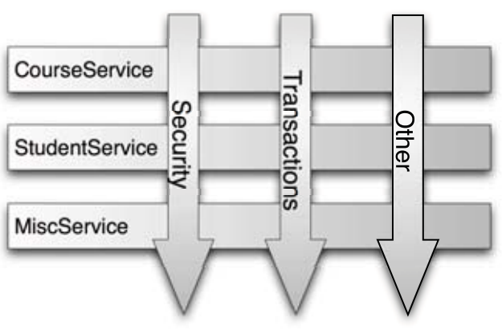

### Spring Interview Questions & Answers

> Click :star: if you like the project. Pull Request is highly appreciated. Follow me [@AltafJava](https://twitter.com/altafjava) for technical updates.


## Table of Contents

| No. | Questions                                                                                                                                                                |
| --- | ------------------------------------------------------------------------------------------------------------------------------------------------------------------------ |
|     | **Introduction**                                                                                                                                                         |
| 1   | [What is Spring Framework?](#What-is-Spring-Framework)                                                                                                                   |
| 2   | [What is open source?](#What-is-open-source)                                                                                                                             |
| 3   | [What is an application framework?](#What-is-an-application-framework)                                                                                                   |
| 4   | [How is Spring lightweight?](#How-is-Spring-lightweight)                                                                                                                 |
| 5   | [What is Inversion of Control (IoC)?](#What-is-Inversion-of-Control-IoC)                                                                                                 |
| 6   | [What is an aspect-oriented container framework?](#What-is-an-aspect-oriented-container-framework)                                                                       |
| 7   | [What are the features of Spring Framework?](#What-are-the-features-of-Spring-Framework)                                                                                 |
| 8   | [What are the differences between Spring & Struts?](#What-are-the-differences-between-Spring--Struts)                                                                    |
| 9   | [What is Java EE?](#What-is-Java-EE)                                                                                                                                     |
| 10  | [What are the limitations of Java EE (API)?](#What-are-the-limitations-of-Java-EE-API)                                                                                   |
| 11  | [What is Boilerplate code? What are the problems if we write the boilerplate code?](#What-is-Boilerplate-code-What-are-the-problems-if-we-write-the-boilerplate-code)    |
| 12  | [Can we say Spring is the replacement of Java EE?](#Can-we-say-Spring-is-the-replacement-of-Java-EE)                                                                     |
| 13  | [What are the different modules available in Spring?](#What-are-the-different-modules-available-in-Spring)                                                               |
| 14  | [What is POJO?](#What-is-POJO)                                                                                                                                           |
| 15  | [What is a Java Bean?](#What-is-a-Java-Bean)                                                                                                                             |
| 16  | [Similarities and Differences between POJO & Java Bean?](#Similarities-and-Differences-between-POJO--Java-Bean)                                                          |
| 17  | [What is a Spring Bean?](#What-is-a-Spring-Bean)                                                                                                                         |
| 18  | [Java Bean vs Spring Bean?](#Java-Bean-vs-Spring-Bean)                                                                                                                   |
| 19  | [What are the ways of collaborating objects?](#What-are-the-ways-of-collaborating-objects)                                                                               |
| 20  | [Differences Between Inheritance Vs Composition?](#Differences-Between-Inheritance-Vs-Composition)                                                                       |
| 21  | [When to use Inheritance?](#When-to-use-Inheritance)                                                                                                                     |
| 22  | [When to use Composition?](#When-to-use-Composition)                                                                                                                     |
| 23  | [Difference between Tight coupling & Loose coupling?](#Difference-between-Tight-coupling--Loose-coupling)                                                                |
| 24  | [Describe "_Favour composition over inheritance_".](#Describe-Favour-composition-over-inheritance)                                                                       |
| 25  | [Describe "_Program to an interface, not an implementation_".](#Describe-Program-to-an-interface-not-an-implementation)                                                  |
| 26  | [What is the Open-Closed principle?](#What-is-the-Open-Closed-principle)                                                                                                 |
| 27  | [What is a Design Pattern?](#What-is-a-Design-Pattern)                                                                                                                   |
| 28  | [What is IoC Container?](#What-is-IoC-Container)                                                                                                                         |
| 29  | [What is Configuration Metadata?](#What-is-Configuration-Metadata)                                                                                                       |
| 30  | [How many types of IoC container/how to create IoC container?](#How-many-types-of-IoC-containerhow-to-create-IoC-container)                                              |
| 31  | [BeanFactory vs ApplicationContext?](#BeanFactory-vs-ApplicationContext)                                                                                                 |
|     | **Spring Core**                                                                                                                                                          |
| 32  | [What is Bean scope?](#What-is-Bean-scope)                                                                                                                               |
| 33  | [What type of dependency injection spring supports?](#What-type-of-dependency-injection-spring-supports)                                                                 |
| 34  | [Difference between constructor and setter injection.](#Difference-between-constructor-and-setter-injection)                                                             |
| 35  | [Which one is the best dependency injection? Setter, Constructor or Field injection?](#Which-one-is-the-best-dependency-injection-Setter-Constructor-or-Field-injection) |
| 36  | [What is the type ambiguity in constructor injection?](#What-is-the-type-ambiguity-in-constructor-injection)                                                             |
| 37  | [How can we resolve type ambiguity in constructor injection?](#How-can-we-resolve-type-ambiguity-in-constructor-injection)                                               |
| 38  | [More question will be added soon...](#More)                                                                                                                             |

## Introduction

1. ### What is Spring Framework?

   Spring Framework is an open source application framework. We can also say that it is a lightweight inversion of control(IoC) container and aspect-oriented container framework for the Java platform. Spring handles the infrastructure so that we can focus on our application development. It was created by **Rod Johnson**. In 2003 Spring came into existence.

   <div align="right">
       <b><a href="#table-of-contents">⬆ Back to Top</a></b>
   </div>

2. ### What is open source?

   Open source simply means the source code that anyone can see, inspect, modify, and enhance. If you want you can also contribute to [spring-framework](https://github.com/spring-projects/spring-framework).

   <div align="right">
     <b><a href="#table-of-contents">⬆ Back to Top</a></b>
   </div>

3. ### What is an application framework?

   An application framework is a software library that provides a fundamental structure to support the development of applications for a specific environment. An application framework acts as the skeletal support to build an application. The intention of designing application frameworks is to lessen the general issues faced during the development of applications.

   <div align="right">
     <b><a href="#table-of-contents">⬆ Back to Top</a></b>
   </div>

4. ### How is Spring lightweight?

   Spring is considered lightweight compared to traditional Java EE applications. If we want to run a Java EE application, we can't just create a small application that will run on its own. We shall need a Java EE application server to run our application such as Glassfish, Wildfly, WebLogic, Websphere etc. Most application servers are big and complex pieces of software, that are not trivial to install or configure. Hence If we use Spring then we won't need such things.

   Secondly, Spring provides various modules for different purposes. These modules are grouped into Core Container, Data Access/Integration, Web, AOP (Aspect Oriented Programming), Instrumentation, Messaging, and Test, as shown in the following diagram. To use one or part of the module we don't need to inject all the modules. For example, we can use Spring JDBC without Spring Web.

   

   <div align="right">
     <b><a href="#table-of-contents">⬆ Back to Top</a></b>
   </div>

5. ### What is Inversion of Control (IoC)?

   Inversion of Control is a principle in Software Engineering by which the control of objects or portions of a program is transferred to a container or framework.

   For example, say our application has a text editor component and we want to provide spell checking. Our standard code would look something like this:

   ```java
   public class TextEditor {
       private SpellChecker checker = new SpellChecker();
   }
   ```

   Here TextEditor needs a SpellChecker object. Means TextEditor is dependent on SpellChecker and we are manually instantiating the TextEditor object. Means we are managing the dependency. Means we have the control. Now look at the below code:

   ```java
   public class TextEditor {
      private SpellChecker checker;

      public TextEditor(SpellChecker checker) {
          this.checker = checker;
      }
   }
   ```

   Here we are asking the Spring to instantiate the SpellChecker object and pass in the constructor of TextEditor i.e. Constructor Injection. Means Spring is managing the dependency. Now the control is transferred from Programmer to Spring. This is nothing but Inversion of Control.

  <div align="right">
    <b><a href="#table-of-contents">⬆ Back to Top</a></b>
  </div>

6. ### What is an aspect-oriented container framework?

   In computing, aspect-oriented programming (AOP) is a programming paradigm that aims to increase modularity by allowing the separation of cross-cutting concerns. In simple words we can say that it is a methodology which will separate cross-cutting concerns from core concerns. For example, if writing an application for handling medical records, the indexing of such records is a core concern, while logging a history of changes to the record database or user database, or an authentication system, would be cross-cutting concerns.

   **Core concern:** The logic that seems to be mandatory and without having that logic the existence of our application will not be there, such kind of logic is considered as core concern. Ex: writing business logic, fetching data from database/external API etc.

   **Cross-Cutting concern:** The program logic which is common across the application and the presence/absence of that logic does not impact core business functionality but if we apply the cross-cutting logic then it affects multiple points of an application is nothing but cross-cutting logic. Ex: Logging, Caching, Transaction processing, Security etc.

   

   The above figure represents a typical application that’s broken down into modules. Each module’s main concern is to provide services for its particular domain. But each module also requires similar ancillary functionalities, such as security, logging & transaction management.

   Spring has provided rich support for aspect-oriented programming in its AOP module. Hence we can say that Spring is an aspect-oriented container framework.

  <div align="right">
    <b><a href="#table-of-contents">⬆ Back to Top</a></b>
  </div>

7. ### What are the features of Spring Framework?

   - **Versatile:** Spring can be called as a framework of frameworks because it provides support to various other frameworks such as Struts, Hibernate, Tapestry, EJB, JSF etc. If we want to use Spring in the existing application we can use it without removing the existing technology and don't need to rewrite the code for existing functionality that is nothing but Versatile application development.

     Prior to Spring, Struts was so popular in the market. Almost every company was using the Struts. Now Spring says let the existing investments(code/technology) be in the same way. We don't demand you to modify any of your existing investments. In addition to the existing investments you have, start adding the Spring framework into your project. Spring is versatile & flexible in such a way, it can dissolve into your existing project and can make your project more richer, much better & much stronger than earlier one.

   - **Non-Invasive:** We don't need to extend/implement any Spring provided class/interface to our classes. So whenever we want we can change Spring framework to any other framework. In this case no need to change the logic of our classes.

   - **Lightweight:** Actually Spring is a vast framework but Spring people divided the whole framework into different modules. They are designed in such a way that no module is dependent on other modules except the Spring Core module. Hence according to our requirement we can learn/use a particular module. We don't need to learn the whole framework to use the part of it. Example: We can use Spring ORM module without Spring Web module.

   - **Dependency Injection:** The process of injecting the target object into the dependent object is nothing but dependency injection. Let's take an example: There is an `Employee` class. It requires an `Address` object. Means `Employee` class is dependent on `Address` class. Hence `Employee` class becomes the dependent object and the `Address` class becomes the target object.

     ```java
     @Component
     class Employee {
       private int id;
       private String name;
       private Address address;

       Employee() {
         id = 10;
         name="David";
         address = new Address();
       }
     }
     ```

     ```java
     @Component
     class Address {
       private String street;
       private String city;

       Address() {
         street="Wall Street";
         city="New York";
       }
     }
     ```

     In the above code, Spring is creating both the objects(Employee & Address) and injecting the address object into Employee class constructor.

     There are 3 types of Dependency Injection:

     - Constructor Injection: Dependencies are provided as constructor parameters. Ex: Spring, Pico container etc
     - Setter Injection: Dependencies are assigned through setter methods. Ex: Spring
     - Field Injection: Dependencies are assigned directly through the variables. Ex: Spring
     - Interface Injection: Injection is done through an interface. Ex: Avalon, but Avalon has been closed now

     **Note:** Spring supports only Constructor and Setter Injection.

   - **IoC Container:** Spring has provided a container which is responsible for collaborating objects & managing the lifecycle of objects. There are two ways for collaborating objects.

     1. Dependency Pulling

        - Dependency Lookup
        - Contextual Dependency Lookup

     2. Dependency Injection

        - Setter Injection
        - Constructor Injection

   - **AOP:** Aspect-Oriented Programming(AOP) is used for separating cross-cutting concerns (logging, caching, security, etc) from the business logic of the application. For more info [Read this...](#What-is-an-aspect-oriented-container-framework)

   - **MVC Framework:** Used to create web applications or RESTful web services, capable of returning responses in different formats like json,xml etc.

   - **Transaction Management:** Spring framework provides a generic Transaction Management layer which can be used with or without J2EE(JEE) environment. It provides an interface that can scale down to a local transaction and scale up to global transactions (using JTA).

   - **Secure:** Spring has provided a separate module for securing the application. Spring Security is a Java SE/Java EE security framework to provide Authentication, Authorization, SSO and other Security features for Web Applications or Enterprise Applications. Spring Security supports the various types of security such as :

     - Authentication and Authorization.
     - BASIC,Digest and Form-Based Authentication.
     - LDAP Authentication.
     - OpenID Authentication.
     - SSO (Single Sign-On) Implementation.
     - Cross-Site Request Forgery (CSRF) Implementation.
     - "Remember-Me" Feature through HTTP Cookies.
     - Implementation of ACLs.
     - "Channel Security" that means automatically switching between HTTP and HTTPS.
     - JAAS (Java Authentication and Authorization Service).
     - Flow Authorization using Spring WebFlow Framework.
     - WS-Security using Spring Web Services.

   - **Layered Architecture:** Spring framework is a layered architecture which consists of several modules. All modules are built on the top of its core module. These modules provide everything that a developer may need for use in enterprise application development. A developer is always free to choose what features he/she needs and eliminate the modules which are of no use. It's modular architecture enables integration with other frameworks without much hassle.

   - **Exception Handling:** Spring provides a convenient API for translating technology-specific exceptions into unchecked exceptions.

   - **Easy Integration:** Spring is designed to be used with other frameworks as well. We can use ORM, Struts, Hibernate and other frameworks together with Spring. Spring framework does not impose any restriction on the frameworks to be used together.

   - **End to end development:** Spring can be used for development of different kinds of applications like standalone applications, Web applications and applets as well.

  <div align="right">
    <b><a href="#table-of-contents">⬆ Back to Top</a></b>
  </div>

8. ### What are the differences between Spring & Struts?

   Struts framework supports only developing web applications but spring framework supports various types of application development. In a web application not only have web related aspects, but can have various other things like managing business logic, persisting data, transaction management, messaging, calling external web-services etc. In this case Struts not able to serve these aspects but using Spring we can develop JSE, JEE, Remote(RMI), Persistency, Distributed applications etc.

   Technical Differences between Spring & Struts:
   | Spring | Struts |
   | --------------------------- | ---------------------------- |
   | Spring is an application framework which implements both MVC & IoC design pattern.| Struts is a web framework which implements only MVC design pattern. |
   | Spring is a layered architecture. | Struts is a not a layered architecture. |
   | Spring provides abstraction layer on multiple Java technologies including Servlet, JSPs as well as on other framework software like Hibernate, Tapestry, EJB, JSF etc. | Struts provides abstraction layer only on Servlet, JSP technology. |
   | Spring is a lightweight framework which is loosely coupled. | Struts is a heavyweight framework which is tightly coupled. |
   | Spring provides easy integration with ORM, JDBC technologies. | Struts does not provide support for integrating with ORM, JDBC technology. Manually we need to write code. |
   | Spring is non-invasive which means it doesn’t force a programmer to extend/implement their class from any predefined class or interface given by Spring API. | Struts is invasive. Means it forces the programmer to extend the base class provided by Struts API. |
   |Spring allows JSP, Velocity, Free maker, Excel and PDF for view components. |Struts allows only JSP as view components.|

  <div align="right">
    <b><a href="#table-of-contents">⬆ Back to Top</a></b>
  </div>

9. ### What is Java EE?

   Java EE is an api/specification. Anyone is open to develop and provide a working implementation of the specification. The concrete implementations are the so-called application servers like WildFly, TomEE, GlassFish, Liberty, WebLogic, etc. There are also Servlet containers which implement only the JSP/Servlet part of the huge Java EE API such as Tomcat, Jetty, etc.

   We can develop Web and Enterprise applications using Java EE. Java EE platforms provide an API and runtime environment for developing applications.

  <div align="right">
    <b><a href="#table-of-contents">⬆ Back to Top</a></b>
  </div>
 
10. ### What are the limitations of Java EE (API)?
 
    - Since Java EE is an API and API is partial. Means it mostly contains interfaces & abstract classes. There may be some concrete classes, enums as well but still we need implementation to develop applications.
    - API does not provide boilerplate code.
    - API does not promote rapid application development.
    - API is huge in nature and the classes are interdependent with each other. For example: Consider the following code which will fetch the data from `mysql` database using JDBC API.
 
      ```java
      Connection con=DriverManager.getConnection("url","username","password");
      Statement st=con.createStatement();
      ResultSet rs=st.executeQuery("select * from emp");
      while(rs.next()) {
        System.out.println(rs.getString(1);
      }
      ```
 
      Here ResultSet is dependent on Statement. Without having a `Statement` object we cannot create a `ResultSet` object. Again Statement is dependent on Connection. Without having a `Connection` object we cannot create a `Statement` object. Considering these facts it will take a lot of time to learn.
 
  <div align="right">
    <b><a href="#table-of-contents">⬆ Back to Top</a></b>
  </div>
 
11. ### What is Boilerplate code? What are the problems if we write the boilerplate code?
 
    The repetitive code that every developer needs to write at many places with little or no modification to achieve some task is called the boilerplate code.
 
    How do we get the connection while executing the JDBC code?
 
    ```java
    Class.forName("com.mysql.jdbc.Driver");
    Connection con=DriverManager.getConnection("url","username","password");
    Statement st=con.createStatement();
    ResultSet rs=st.executeQuery("select * from emp");
    while(rs.next()) {
      System.out.println(rs.getString(1);
    }
    ```
 
    - Load & register the `Driver` class.
    - Invoke the `getConnection()` method on DriverManager to obtain the `Connection` object.
    - Create the `Statement` object by invoking `createStatement()` method.
    - Get the `ResultSet` object by invoking `executeQuery("query")`.
 
    Is there any alternative to these steps? Actually, no! Whenever, wherever we have to perform JDBC operations, these same steps have to be repeated every time by everyone. This kind of repetitive code is nothing but boilerplate code. The boiler plate code makes the development unnecessarily lengthier and complex.
 
    If API does not provide boilerplate code then we need to write the huge amount of code. If we write huge amount of code then
 
    - It will take a huge amount of time.
    - It will take a huge effort.
    - We need more resources(people) and the cost of the development will become high.
    - Many chances to increase the bug.
    - It will take more time for testing and the cost of the testing will become high.
    - Maintenance of the project and making changes in the code will be difficult.
 
    Considering the above points API does not promote rapid application development. Hence instead of using Java EE we can use Spring framework as it provides the boilerplate code. Hence we can develop the same applications whatever we can build using Java EE in less time & with less amount of code.
 
  <div align="right">
    <b><a href="#table-of-contents">⬆ Back to Top</a></b>
  </div>
 
12. ### Can we say Spring is the replacement of Java EE?
 
    No, Spring is not the replacement of Java EE. Spring is built on the top of Java EE. Spring internally uses Java EE. Our application will talk to the Spring provided classes and Spring provided classes talk to Java EE internally. Without Java EE, the existence of the Spring will not be there. Just like Hibernate is nothing without JDBC or **Omelette (Spring) is not possible without Egg (Java EE)**. Rather we can say Spring is the complement to Java EE.
 
  <div align="right">
    <b><a href="#table-of-contents">⬆ Back to Top</a></b>
  </div>

13. ### What are the different modules available in Spring?

    Spring Framework contains a lot of features which are well-organized in about 20 modules. These modules can be grouped together based on their primary features into _Core Container_, _Data Access/Integration_, _Web_, _AOP_, _Instrumentation_, _Messaging_, and _Test_, as shown in the following diagram.
    

    **Core Container:** The Core Container consists of the Core, Beans, Context, Context-Support and Expression modules.

    `spring-core` & `spring-beans` modules provide the fundamental parts of the framework including IoC and Dependency Injection features. We can use <u>BeanFactory</u> to create the IoC Container. BeanFactory is a sophisticated implementation of the factory design pattern. It removes the need for a programmatic singleton design pattern.

    `spring-context` module builds on the solid base provided by the Core & Beans modules. Means to access objects in a framework-style manner we can use Context module which is similar to a JNDI registry. Context module inherits its features from the Beans module and adds support for internationalization, event propagation, resource loading. Context module also supports Java EE features such as EJB, JMX, and basic remoting. We can use ApplicationContext to create the IoC Container similar to BeanFactory but is more advanced than BeanFactory.

    `spring-context-support` provides support for integrating common third-party libraries into a Spring application context for caching (EhCache, Guava, JCache), mailing (JavaMail), scheduling (CommonJ, Quartz) and template engines (FreeMarker, JasperReports, Velocity).

    `spring-expression` module provides a powerful Expression Language for querying and manipulating an object graph at runtime. It is an extension of the unified expression language (unified EL) as specified in the JSP 2.1 specification. The language supports setting and getting property values, property assignment, method invocation, accessing the content of arrays, collections and indexers, logical and arithmetic operators, named variables, and retrieval of objects by name from Spring’s IoC container. It also supports list projection and selection as well as common list aggregations.

    **Test:** `spring-test` module supports the unit testing and integration testing of Spring components with JUnit or TestNG. It provides consistent loading of Spring ApplicationContexts and caching of those contexts. It also provides mock objects so that we can test our code in isolation.

    **AOP:** `spring-aop` module provides an AOP Alliance-compliant aspect-oriented programming implementation which allows to separate cross-cutting concerns from core concerns. [Click here](#What-is-an-aspect-oriented-container-framework) for more info.

    **AspectJ:** To provide integration with AspectJ, Spring has provided a separate module `spring-aspects`.

    **Instrumentation:** `spring-instrument` module provides class instrumentation support and classloader implementations to be used in certain application servers. The `spring-instrument-tomcat` module contains Spring’s instrumentation agent for Tomcat.

    **Messaging:** Spring Framework provides extensive support for integrating with messaging systems from simplified use of the JMS API using JmsTemplate to a complete infrastructure to receive messages asynchronously. `Spring AMQP` provides a similar feature set for the Advanced Message Queuing Protocol.

    **Data Access/Integration:** The Data Access/Integration layer consists of the JDBC, ORM, OXM, JMS, and Transaction modules.

    `spring-jdbc` module provides a JDBC-abstraction layer that removes the need to do tedious JDBC coding and parsing of database-vendor specific error codes.

    `spring-tx` module supports programmatic and declarative transaction management for classes that implement special interfaces and for all your POJOs (Plain Old Java Objects).

    `spring-orm` module provides integration layers for popular object-relational mapping APIs, including JPA and Hibernate. Using the spring-orm module we can use these O/R-mapping frameworks in combination with all of the other features Spring offers, such as the simple declarative transaction management feature mentioned previously.

    `spring-oxm` module provides an abstraction layer that supports Object/XML mapping implementations such as JAXB, Castor, JiBX and XStream.

    `spring-jms` module (Java Messaging Service) contains features for producing and consuming messages. Since Spring Framework 4.1, it provides integration with the `spring-messaging` module.

    **Web:** The Web layer consists of the Web, Web MVC, Websocket and Web MVC Portlet modules.

    `spring-web` module provides basic web-oriented integration features such as multipart file upload functionality and the initialization of the IoC container using Servlet listeners and a web-oriented application context. It also contains an HTTP client and the web-related parts of Spring’s remoting support.

    `spring-webmvc` module (also known as the Web-Servlet module) contains Spring’s model-view-controller (MVC) and REST Web Services implementation for web applications. Spring’s MVC framework provides a clean separation between domain model code and web forms and integrates with all of the other features of the Spring Framework.

    WebSocket is a bi-directional, full-duplex, persistent connection between a web browser and a server. Once a WebSocket connection is established the connection stays open until the client or server decides to close this connection. A typical use case could be when an app involves multiple users communicating with each other, like in a chat. By using `spring-websocket` we can build WebSocket applications.

    `spring-webmvc-portlet` is a framework released by Spring community for easier development of Java Portlets. Portlets are web components similar to Servlets managed by Portlet Container (similar to Web Container which manages Servlets). Portlets are components used in the UI layer for displaying the content fetched from different data sources to the end user.

  <div align="right">
    <b><a href="#table-of-contents">⬆ Back to Top</a></b>
  </div>

14. ### What is POJO?

    **POJO:** POJO stands for `Plain Old Java Object`. If a public class does not implement/extend an prespecified interface/class and does not have any prespecified annotation and can be directly compiled & executable under the JDK without having any classpath reference to a library & framework is called a POJO class. Below `EmployeePojo.java` & `MyThread.java` are POJO classes.

    ```java
    public class EmployeePojo {
        private String name;
        private int age;
        private double salary;

        public EmployeePojo() {
        }

        public EmployeePojo(String name, int age, double salary) {
            this.name = name;
            this.age = age;
            this.salary = salary;
        }

        public String empInfo() {
           return name + " " + age + " " + salary;
        }
    }
    ```

    ```java
    class MyThread extends Thread {
        public void run() {
          // ...
        }
    }
    ```

    Followings are not POJO classes:

    ```java
    public class MyServlet extends javax.servlet.http.HttpServlet {
        /* MyServlet is not a POJO class because it extends the HttpServlet class which is not a part of Java SE API. HttpServlet is part of the Servlet API.*/
    }
    ```

    ```java
    public class Bar implements javax.ejb.EntityBean {
        /* Bar is not a POJO class because it implements the EntityBean interface which is not a part of Java SE API. EntityBean is part of the EJB API.*/
    }
    ```

    ```java
    @javax.persistence.Entity
    public class Foo {
        /*Foo is not a POJO class because it uses the @Entity annotation which is not a part of Java SE API. @Entity is a part of JPA.*/
    }
    ```

    _Note: Prespecified interface/class/annotation means except the JAVA SE API(third party interface/class/annotation). We can even implement `Serializable` interface & follow setter/getter pattern for methods in POJO but it is our own wish._

  <div align="right">
    <b><a href="#table-of-contents">⬆ Back to Top</a></b>
  </div>
 
15. ### What is a Java Bean?
 
    **Java Bean:** A JavaBean is nothing but a POJO class but have a strict set of rules:
 
    - _Access levels:_ Properties should be private and expose getters and setters.
    - _Method names:_ Getters & Setters follow the `getX()` & `setX()` convention (in the case of a boolean, `isX()` can be used for a getter).
    - _Default Constructor:_ A no-argument constructor must be present so that an instance can be created without providing arguments for example during deserialization.
    - _Serializable:_ Implementing the Serializable interface allows us to store the state.
 
    Example:- `EmployeeBean.java`
 
    ```java
    public class EmployeeBean implements java.io.Serializable {
 
        private static final long serialVersionUID = 1L;
 
        private String name;
        private int age;
        private double salary;
 
        public EmployeeBean() {
        }
 
        public EmployeeBean(String name, int age, double salary) {
            this.name = name;
            this.age = age;
            this.salary = salary;
        }
 
        public String getName() {
            return name;
        }
 
        public void setName(String name) {
            this.name = name;
        }
 
        // additional getters/setters
    }
 
    ```
 
  <div align="right">
    <b><a href="#table-of-contents">⬆ Back to Top</a></b>
  </div>
 
16. ### Similarities and Differences between POJO & Java Bean?
 
    **Similarities:**
 
    - Both classes must be public i.e accessible to all.
    - Properties or variables defined in both classes must be private i.e. can't be accessed directly.
    - Both classes must have a default constructor i.e no argument constructor.
 
    **Differences:**
 
    - Java Bean must implement `java.io.Serializable` but it is not mandatory in case of POJO.
    - There must be getters & setters in Java Bean but it is optional in case of POJO.
 
    _Note: Due to this we can say, All Java Beans are POJOs but not all POJOs are Java Beans._
 
  <div align="right">
    <b><a href="#table-of-contents">⬆ Back to Top</a></b>
  </div>
 
17. ### What is a Spring Bean?
 
    A class which contains attributes and methods with business logic to perform some processing and its object is instantiated, assembled and otherwise managed by a Spring IoC container is called a Spring Bean. There is no restriction for creating spring beans. It can refer to any third party interface/class/annotation.
 
  <div align="right">
    <b><a href="#table-of-contents">⬆ Back to Top</a></b>
  </div>
 
18. ### Java Bean vs Spring Bean?
 
    - Java Bean is always serializable, Spring Bean doesn’t need to.
    - Java Bean must have a default no-arg constructor, Spring Bean doesn’t need to.
    - Spring bean is managed by Spring IoC Container, Java Bean is not.
 
    _Note: Every java bean can be a spring bean but every spring bean cannot be a java bean._
 
  <div align="right">
    <b><a href="#table-of-contents">⬆ Back to Top</a></b>
  </div>
 
19. ### What are the ways of collaborating objects?
 
    In a project, we don't have only one class to fulfil the business requirements. We can have a lot of classes and obviously these classes can't be isolated. Means one class needs another class to complete its functionality. Hence one class will talk to another class. Means one class will reuse its functionality by calling its method. This is nothing but collaborating objects. There are 2 ways of collaborating objects.
 
    **Inheritance:** The process of acquiring attributes & methods from one class to another class is called Inheritance. The class being inherited is called Super Class(Parent) and the class that inherits from another class is called Sub Class(Child). The aim of inheritance is to provide the reusability of code so that a class has to write only the unique features and rest of the common properties and functionalities. The biggest advantage of Inheritance is that the code that is already present in super class need not be rewritten in the sub class. Inheritance represents an `IS-A` relationship. Means _PhysicsTeacher is a Teacher_. Example: `PhysicsTeacher.java`
 
    ```java
    class Teacher {
        String designation = "Teacher";
        String collegeName = "IIT Madras";
 
        void does() {
           System.out.println("Does(): Teaching");
        }
      }
 
    public class PhysicsTeacher extends Teacher {
        String mainSubject = "Physics";
 
        public static void main(String[] args) {
            PhysicsTeacher pt = new PhysicsTeacher();
            System.out.println("College Name: "+pt.collegeName);
            System.out.println("Designation: "+pt.designation);
            System.out.println("Main Subject: "+pt.mainSubject);
            pt.does();
        }
    }
    ```
 
    ```
    Output:
      College Name: IIT Madras
      Designation: Teacher
      Main Subject: Physics
      Does(): Teaching
    ```
 
    **Association:** Association is the relation between two separate classes which establishes through their Objects. Association relationship indicates how objects know each other and how they are using each other’s functionality. It represents the `HAS-A` relationship. Association in Java can have the following relationships.
 
    - `one-to-one:` A person can have only one passport.
    - `one-to-many:` A bank can have many employees.
    - `many-to-one:` Many students work on the same project.
    - `many-to-many:` A user can belong to multiple communities, and a community can have multiple users.
 
    Example: The below program demonstrates an association in Java.
 
    ```java
    class Account {
        private String bankName;
        private long accountNo;
 
        Account(String bankName, long accountNo) {
            this.bankName = bankName;
            this.accountNo = accountNo;
        }
 
        public String getBankName() {
            return this.bankName;
        }
 
        public long getAccountNumber() {
            return this.accountNo;
        }
    }
 
    class Employee {
        private String empName;
 
        Employee(String empName) {
            this.empName = empName;
        }
 
        public String getEmpName() {
           return empName;
        }
    }
 
    public class Association {
 
      public static void main(String[] args) {
          Employee emp = new Employee("Andrew");
          Account acc = new Account("Citi Bank", 12345);
          System.out.println(emp.getEmpName() + " has an account with " + acc.getBankName() + " with Account Number:" + acc.getAccountNumber());
      }
    }
    ```
 
    ```
    Output: Andrew has an account with Citi Bank with Account Number:12345
    ```
 
    Here, we have a class `Account` that has a bankName and accountNo. Next, we have an `Employee` class. We know that every employee will have an account number for depositing salary etc. So what we do is, instead of writing another class or method to read the Employee’s bank account details, we directly reuse the existing Account class. In other words, we associate an `Account` object with the `Employee` so that we get the Employee’s bank account details.
 
    There are 2 forms of Association.
 
    **1. Aggregation:** It is a unidirectional association i.e. a one way relationship. For example, a department can have students but vice versa is not possible. In Aggregation, both the entities(objects) can survive individually which means ending one entity will not affect the other entity(object). Therefore, it is often referred to as weak association. Let’s take the example of a player and a team.
 
    ```java
    import java.util.ArrayList;
    import java.util.List;
    import java.util.stream.Collectors;
 
    class Team {
      private String teamName;
      private List<Player> players;
 
      public Team(String teamName, List<Player> players) {
        this.teamName = teamName;
        this.players = players;
      }
 
      private List<String> getPlayerInfo() {
        return players.stream().map(player -> player.getPlayerName() + "(" + player.getPlayerAge() + ")").collect(Collectors.toList());
      }
 
      public String getTeamInfo() {
        return teamName + ": " + getPlayerInfo();
      }
    }
 
    class Player {
      private String playerName;
      private int playerAge;
 
      public Player(String playerName, int playerAge) {
        this.playerName = playerName;
        this.playerAge = playerAge;
      }
 
      public String getPlayerName() {
        return playerName;
      }
 
      public int getPlayerAge() {
        return playerAge;
      }
    }
 
    public class Aggregation {
      public static void main(String[] args) {
        Player player1 = new Player("David Warner", 34);
        Player player2 = new Player("Rashid Khan", 22);
 
        List<Player> players = new ArrayList<>();
        players.add(player1);
        players.add(player2);
 
        Team team = new Team("Sunrisers Hyderabad", players);
        System.out.println(team.getTeamInfo());
      }
    }
 
    ```
 
    ```
    Output: Sunrisers Hyderabad: [David Warner(34), Rashid Khan(22)]
 
    ```
 
    Here if we destroy the team object, but still player1 & player2 objects will be alive.
 
    **2. Composition:** It is a restricted form of Aggregation in which two entities (or we can say classes) are highly dependent on each other. For e.g. Human and Heart. A human needs a heart to live and a heart cannot survive without a human body.
 
    ```java
    class Human {
        private String name;
        private Heart heart;
 
        public Human(String name) {
            this.name = name;
            heart = new Heart(290, 72);
        }
 
        public String getHumanInfo() {
            return name + ": " + heart.toString();
        }
    }
 
    class Heart {
        private int weight;
        private int heartBeat;
 
        public Heart(int weight, int heartBeat) {
          this.weight = weight;
          this.heartBeat = heartBeat;
        }
 
        @Override
        public String toString() {
          return "Heart [weight=" + weight + "grams, heartBeat=" + heartBeat + "times/min]";
        }
    }
 
    public class Composition {
        public static void main(String[] args) {
            Human human = new Human("David");
            System.out.println(human.getHumanInfo());
        }
    }
 
    ```
 
    ```
    Output: David: Heart [weight=290grams, heartBeat=72times/min]
 
    ```
 
    Here, if we destroy the human object, the heart object will also be destroyed.
 
  <div align="right">
    <b><a href="#table-of-contents">⬆ Back to Top</a></b>
  </div>

20. ### Differences Between Inheritance Vs Composition?

    | Inheritance                                                                          | Composition                                            |
    | ------------------------------------------------------------------------------------ | ------------------------------------------------------ |
    | Inheritance represents an 'Is-A' relationship.                                       | Composition depicts the 'Has-A' relationship.          |
    | A class can extend only one class. Therefore, we can reuse code from only one class. | In composition, we can reuse code of multiple classes. |
    | Inheritance is a static or compile time binding.                                     | Composition is a dynamic or run time-binding.          |
    | We cannot reuse code from the final class.                                           | It allows code reusability even from final classes.    |
    | It exposes both public and protected methods.                                        | It allows to invoke only public methods.               |

  <div align="right">
    <b><a href="#table-of-contents">⬆ Back to Top</a></b>
  </div>

21. ### When to use Inheritance?

    1. We can use inheritance when we know there is an `"IS-A"` relationship between a child and its parent class. Some examples would be:

       - A person is a human.
       - A cat is an animal.
       - A car is a vehicle.

    2. If the properties & behaviours of super class is common to subclass(sub class can have its own properties & behaviours) then we should use inheritance.
    3. If we are not satisfied with the functionality of a class or if we want to change the functionality of a class without having source code then we can go for inheritance so that we can override the methods and provide a new implementation.
    4. If we need to use almost all the methods of the superclass the we can go for inheritance.

    > Bad example of Inheritance:

    ```java
    import java.util.ArrayList;
    public class BadExampleInheritance extends ArrayList<Object> {

        public static void main(String[] args) {
            BadExampleInheritance list = new BadExampleInheritance();
            list.add("Mobile");
            list.add("Laptop");
            list.add("Television");
            list.forEach(System.out::println);
        }
    }
    ```

    Since, ArrayList has a lot of methods and we are inheriting all the methods but using only two methods i.e. `add()` & `forEach()`. Except these, no other methods are being used which is resulting in tightly coupled code that is both confusing and difficult to maintain. If we look closely, it is also clear that this code does not pass the `"IS-A"` test.

    > Some predefined good examples of inheritance:

    ```java
      class IndexOutOfBoundsException extends RuntimeException {...}

      class ArrayIndexOutOfBoundsException extends IndexOutOfBoundsException {...}

      class FileWriter extends OutputStreamWriter {...}

      class OutputStreamWriter extends Writer {...}

      interface Stream<T> extends BaseStream<T, Stream<T>> {...}
    ```

  <div align="right">
    <b><a href="#table-of-contents">⬆ Back to Top</a></b>
  </div>
 
22. ### When to use Composition?
 
    1. If an object has(or is part of) another object, we can go for composition. Some examples would be:
       - A car has a battery (a battery is part of a car).
       - A person has a heart (a heart is part of a person).
       - A house has a living room (a living room is part of a house).
    2. If we don't need all the behaviours(methods) of a class. Means we need only a few functionalities of a class then we should go for composition. We can see in the below example, we are using only 2 methods of ArrayList class without inheriting all of them.
 
       ```java
       import java.util.ArrayList;
       import java.util.List;
       public class GoodExampleComposition {
 
         public static void main(String[] args) {
             List<String> list = new ArrayList<>();
             list.add("Mobile");
             list.add("Laptop");
             list.add("Television");
             list.forEach(System.out::println);
         }
       }
       ```
 
       This results in simpler, less coupled code that will be easier to understand and maintain.
 
  <div align="right">
    <b><a href="#table-of-contents">⬆ Back to Top</a></b>
  </div>

23. ### Difference between Tight coupling & Loose coupling?

    A situation where an object can be used by another object is termed as coupling. It is the process of collaborating together and working for each other. It simply means that one class requires another class to complete its task. There are 2 types of coupling.

    **1. Tight coupling:** When one class is highly dependent on another class. Means a class creates objects of another class to call its methods so that fulfil its functionality becomes tightly coupled. This scenario arises when a class assumes too many responsibilities or when one concern is spread over many classes rather than having its own class.

    Let's understand by an example: There is a Manager class which is dependent on SmartWorker class. Means until Manager has not smartWorker object it cannot complete its functionality. Therefore, Manager is creating an object of SmartWorker and calling its method.

    ```java
    class LazyWorker {
        public void work() {
            System.out.println("Lazy Worker working");
        }
    }

    class Manager {
        LazyWorker lazyWorker = new LazyWorker();

        public void manage() {
            lazyWorker.work();
        }
    }

    public class TightlyCoupled {
        public static void main(String[] args) {
            Manager manager = new Manager();
            manager.manage();
        }
    }
    ```

    Let’s say the requirement changes and the Manager wants to add one more worker that is SmartWorker. What shall we do now? We can create a class for SmartWorker and create an object and call its method like below.

    ```java
    class SmartWorker {
        public void work() {
            System.out.println("Smart Worker working");
        }
    }

    class LazyWorker {
        public void work() {
            System.out.println("Lazy Worker working");
        }
    }

    class Manager {
        LazyWorker lazyWorker = new LazyWorker();
        SmartWorker smartWorker = new SmartWorker();

        public void manage() {
            lazyWorker.work();
            smartWorker.work();
        }
    }

    public class TightlyCoupled {
        public static void main(String[] args) {
            Manager manager = new Manager();
            manager.manage();
        }
    }
    ```

    It's very simple right? but we notice that the source code is tightly coupled and that’s the reason we had to modify the existing Manager class.
    We saw that Manager class was modified at two places. Add an extra object of `smartWorker` and modified `manageWork()` method. Therefore, it violets the [open–closed principle](#What-is-Open-Closed-principle) (A class should be open for extension but closed for modification). The main problem with tightly coupled code is, it requires modification and testing. This is a simple program, but consider it is a large project and Manager class is very complex and has tons of operations to perform. As we know in real time no product is released without testing. Hence tightly coupled code means

    - more developer effort
    - more developer time
    - more tester effort
    - more tester timer
    - more cost
    - slow application development
    - project may be delayed

    **2. Loose coupling:** Loose coupling means objects are independent to each other. A loosely coupled code reduces maintenance and efforts. We can achieve loose coupling by using interface & dependency injection. Let's make the above example as loosely coupled.

    ```java
    interface IWorker {
        void work();
    }

    class SmartWorkerImpl implements IWorker {
        @Override
        public void work() {
            System.out.println("Smart Worker working");
        }
    }

    class LazyWorkerImpl implements IWorker {
        @Override
        public void work() {
            System.out.println("Lazy Worker working");
        }
    }

    class Manager {
        IWorker worker = null;

        public void setWorker(IWorker worker) {
            this.worker = worker;
        }

        public void manage() {
            worker.work();
        }
    }

    public class LooselyCoupled {
        public static void main(String[] args) {
            Manager manager = new Manager();
            LazyWorkerImpl lazyWorker = new LazyWorkerImpl();
            manager.setWorker(lazyWorker);
            manager.manage();
            SmartWorkerImpl smartWorker = new SmartWorkerImpl();
            manager.setWorker(smartWorker);
            manager.manage();
        }
    }
    ```

    Here, we have created an interface `IWorker` and `LazyWorkerImpl` is implementing it. In Manager class we have just declared the interface but not directly creating the object of `LazyWorkerImpl`. Instead we have a setter method `setWorker()` which will be used to set the required implementation object of `IWorker`. This is nothing but dependency injection(setter injection).

    Now let’s say requirement changes and Manager want to add one more worker that is SmartWorker. In this case we just need to create another implementation class of `IWorker` that is `SmartWorkerImpl` and pass this object whenever it is required. We don't need to change anything in Manager class. Now creating the object(LazyWorker & SmartWorker) and managing these dependencies is taken care of by our main class i.e. `LooselyCoupled` class. So, if we use Spring framework, this responsibility is transferred to Spring IoC container. In the above program to make it loosely coupled we have have followed certain principles like

    - create an interface.
    - create a setter method for injecting the dependent(target) class.
    - not directly creating objects using concrete class.

    **Hence to work with Spring also, we need to follow some object oriented principles and make our dependent classes(beans) according to the principle so that our classes will be loosely coupled and Spring can effectively manage them. These object oriented principles are:**

    1. **_Favour composition over inheritance_**
    2. **_Program to an interface, not an implementation_**
    3. **_Open-Closed Principle_**
    4. _Don't repeat yourself_
    5. _Encapsulate What Changes_
    6. _Delegation principles_
    7. _Single Responsibility Principle_
    8. _Liskov Substitution Principle_
    9. _Interface Segregation Principle_
    10. _Dependency Inversion Principle_

  <div align="right">
    <b><a href="#table-of-contents">⬆ Back to Top</a></b>
  </div>
 
24. ### Describe "_Favour composition over inheritance_".
 
    _Favor composition over inheritance_ is a one of the popular object-oriented design principles, which helps to create flexible and maintainable code in Java and other object-oriented languages. Using both(composition & inheritance) we can reuse the code but according to this design principle, it is recommended to use composition instead of using inheritance. Let's see why it is recommended?
 
    - If we need multiple functionalities(for example reading & writing data into a file), we need to extend two classes Reader & Writer and as we know java doesn't support multiple inheritance. Therefore, in this case we can't go for inheritance. Hence by using composition we can solve this problem.
 
    - Composition offers better test-ability of a class than Inheritance. If one class is composed of another class, we can easily create a Mock object representing the composed class for sake of testing. Inheritance doesn't provide this luxury. In order to test derived class, we must need its super class. Since unit testing is one of the most important things to consider during software development, especially in test driven development, composition wins over inheritance.
 
      Example: `will be added soon`
 
    - Most of the design patterns use composition over inheritance. For example in Strategy design pattern, composition is used to change the Context’s behavior without touching Context code. Context uses composition to hold the strategy, instead of getting it via inheritance.
 
      ```java
      import java.util.Scanner;
 
      interface PayStrategy {
        boolean pay(int amount);
      }
 
      class GooglePayStrategy implements PayStrategy {
        @Override
        public boolean pay(int amount) {
          System.out.println("Paying " + amount + " using GooglePay");
          return true;
        }
      }
 
      class PhonePayStrategy implements PayStrategy {
        @Override
        public boolean pay(int amount) {
          System.out.println("Paying " + amount + " using PhonePay");
          return true;
        }
      }
      // Factory class to create the implementation of Strategy
      class PayStrategyFactory {
        public PayStrategy createPay(int payerId) {
          if (payerId == 1)
            return new GooglePayStrategy();
          else if (payerId == 2)
            return new PhonePayStrategy();
          else {
            return null;
          }
        }
      }
 
      class Context {
        PayStrategy payStrategy = null;
 
        public Context(PayStrategy payStrategy) {
          this.payStrategy = payStrategy;
        }
 
        public boolean execute(int amount) {
          return payStrategy.pay(amount);
        }
      }
 
      public class Test {
        public static void main(String[] args) {
          // GooglePay=1, PhonePay=2
          System.out.println("Enter Payer Id: ");
          Scanner sc = new Scanner(System.in);
          int payerId = sc.nextInt();
          sc.close();
 
          PayStrategyFactory payStrategyFactory = new PayStrategyFactory();
          PayStrategy payStrategy = payStrategyFactory.createPay(payerId);
 
          if (payStrategy == null) {
            System.err.println("Error: Invalid payer id");
          } else {
            Context context = new Context(payStrategy);
            context.execute(500);
          }
        }
      }
      ```
 
    - Inheritance breaks encapsulation. Inheritance forces the developer of the subclass to know about the internals of the superclass, which means the encapsulation in the superclass is broken.
 
      ```java
      import java.util.Arrays;
      import java.util.Collection;
      import java.util.HashSet;
 
      class MyHashSet extends HashSet<String> {
        public int addCount = 0;
 
        @Override
        public boolean add(String element) {
          addCount += 1;
          return super.add(element);
        };
 
        @Override
        public boolean addAll(Collection collection) {
          addCount += collection.size();
          return super.addAll(collection);
        }
      }
 
      public class Test {
        public static void main(String[] args) {
          MyHashSet mhs = new MyHashSet();
          mhs.addAll(Arrays.asList("One", "Two", "Three"));
          System.out.println("Add Count= " + mhs.addCount);
        }
      }
 
      ```
 
      ```
      Output: Add Count= 6
      ```
 
      It is entirely non-obvious why `addCount` would return `6` instead of `3`. After all, we only added three elements, right? The answer is `HashSet.addAll()` method invokes the `add()` method internally. This means, when we call `mhs.addAll()` method by passing three values, addCount value increases by 3. Inside the `addAll(Collection collection)` method we are calling `super.addAll(collection)` which internally calls the `add()` method 3 times and as we are incrementing on every add operation by one which results 3+1+1+1=6.
 
      Hence to solve this kind of problem, the best approach would be to use composition.
 
      ```java
      import java.util.Arrays;
      import java.util.Collection;
      import java.util.HashSet;
 
      class MyHashSet {
        public int addCount = 0;
 
        private HashSet<String> hashSet = new HashSet<>();
 
        public boolean add(String element) {
          addCount += 1;
          return hashSet.add(element);
        }
 
        public boolean addAll(Collection collection) {
          addCount += collection.size();
          return hashSet.addAll(collection);
        }
      }
 
      public class InheritanceSolutionTest {
        public static void main(String[] args) {
          MyHashSet myHashSet = new MyHashSet();
          myHashSet.addAll(Arrays.asList("One", "Two", "Three"));
          System.out.println("Add Count= " + myHashSet.addCount);
        }
      }
 
      ```
 
      ```
      Output: Add Count= 3
      ```
 
    - Inheritance is more tightly coupled compared to composition.
 
        ```java
        class X {
          public void doo() {
          }
        }

        class Y extends X {
          public void work() {
            doo();
          }
        }
        ```

        As clear in above code, class Y has very strong coupling with class X. If anything changes in superclass X, Y may break dramatically. Suppose in future, class X creates a new method `work()` with the below signature:

        ```java
        public int work() {
          return 0;
        }
        ```

        Change is done in class X but it will make class Y uncompilable[`The return type is incompatible with
        X.work()`]. So this kind of dependency can go up to any level and it can be very dangerous. So we can avoid this tight and unnecessary coupling by using composition.

        ```java
        class X {
          public int work() {
            return 0;
          }

          public void doo() {
          }
        }

        class Y {
          X x = new X();

          public void work() {
            x.doo();
          }
        }

        ```

  <div align="right">
    <b><a href="#table-of-contents">⬆ Back to Top</a></b>
  </div>
 
25. ### Describe "_Program to an interface, not an implementation_".
 
    Whenever we build a larger piece of application, we shall have dependencies to each other classes and these dependencies result tightly coupled to each other classes. Therefore, to make this coupling loosely coupled, we can use interfaces. If we depend on interfaces only, we are decoupled from the implementation. That means the implementation can vary and that's a healthy dependency relationship. For example, for testing purposes we can replace a heavy database implementation with a lighter-weight mock implementation. If we have multiple strategies or algorithms then it is very easy to switch among them if we use this principle. Simply we can say, this principle is used in Strategy Design Pattern.
 
    ```java
    import java.util.Arrays;
    import java.util.List;
 
    interface Database {
      String findById(int id);
      List<String> findAll();
    }
 
    class HeavyWeightDatabase implements Database {
      @Override
      public String findById(int id) {
        return "HeavyWeightDatabase: returning data with id " + id;
      }
 
      @Override
      public List<String> findAll() {
        return Arrays.asList("HWD1", "HWD2", "HWD3");
      }
    }
 
    class LightWeightDatabase implements Database {
      @Override
      public String findById(int id) {
        return "LightWeightDatabase: returning data with id " + id;
      }
 
      @Override
      public List<String> findAll() {
        return Arrays.asList("LWD1", "LWD2", "LWD3");
      }
    }
 
    class DatabaseFactory {
      public Database createDatabaseImpl(String profile) {
        if (profile.equals("prod")) {
          return new HeavyWeightDatabase();
        } else {
          return new LightWeightDatabase();
        }
      }
    }
 
    class DatabaseService {
      Database database = null;
 
      public DatabaseService(Database database) {
        this.database = database;
      }
 
      public List<String> getAllData() {
        return database.findAll();
      }
 
      public String getData(int id) {
        return database.findById(id);
      }
    }
 
    public class Main {
      public static void main(String[] args) {
        DatabaseFactory databaseFactory = new DatabaseFactory();
    //    String profile = "prod";
        String profile = "dev";
        Database database = databaseFactory.createDatabaseImpl(profile);
        DatabaseService databaseService = new DatabaseService(database);
        System.out.println(databaseService.getData(123));
        System.out.println(databaseService.getAllData());
      }
    }
    ```
 
    In the above example, `DatabaseService` don't know the implementation class of `Database` interface and without changing the source code of `DatabaseService` we can easily switch from HeavyWeightDatabase to LightWeightDatabase or vice-versa. This is possible because of this principle. If we don't use this principle and need to change from HeavyWeightDatabase to LightWeightDatabase or vice-versa we will have to modify the `DatabaseService` class which is not recommended.
 
  <div align="right">
    <b><a href="#table-of-contents">⬆ Back to Top</a></b>
  </div>
 
26. ### What is the Open-Closed principle?
 
    The Open-Closed Principle is one of the `SOLID` design principles. SOLID contains five principles which were described by Robert C Martin. SOLID stands for
 
    - S - Single Responsibility Principle
    - O - Open-Closed Principle
    - L - Liskov Substitution Principle
    - I - Interface Segregation Principle
    - D - Dependency Inversion
 
    The open–closed principle states that "_Software entities (classes, modules, functions, etc.) should be open for extension, but closed for modification_". Means, such an entity can allow its behaviour to be extended without modifying its source code. In the above code(Manager/Worker, GooglePayStrategy/PhonePayStrategy and HeavyWeightDatabase/LightWeightDatabase), we have seen how we have implemented this principle by using interfaces.
 
  <div align="right">
    <b><a href="#table-of-contents">⬆ Back to Top</a></b>
  </div>
 
27. ### What is a Design Pattern?
 
    Design pattern is a general, reusable solution to a commonly occurring problem within a given context in software design. It is not a finished design that can be transformed directly into source code. Rather, it is a description or template for how to solve a problem that can be used in many different situations. Design patterns are formalized best practices that the programmer can use to solve common problems when designing an application or system.
 
    In 1994, four authors Erich Gamma, Richard Helm, Ralph Johnson and John Vlissides published a book titled _Design Patterns - Elements of Reusable Object-Oriented Software_ which initiated the concept of Design Pattern in Software development. These authors are collectively known as `Gang of Four(GoF)`. There are a total 23 GoF design patterns. GoF Design Patterns are divided into three categories.
 
    1. **Creational:** Abstract Factory, Builder, Factory Method, Prototype, Singleton
    2. **Structural:** Adapter, Bridge, Composite, Decorator, Facade, Flyweight, Proxy
    3. **Behavioral:** Chain of Responsibility, Command, Interpreter, Iterator, Mediator, Memento, Observer, State, Strategy, Template Method, Visitor
 
  <div align="right">
    <b><a href="#table-of-contents">⬆ Back to Top</a></b>
  </div>

28. ### What is IoC Container?

    IoC Container is a container of [Spring Beans](#What-is-a-Spring-Bean). The main objective of this container is to create the objects, wire them together, configure and manage their complete life cycle from creation till destruction. We provide Spring Beans(POJO) and some configuration metadata to the IoC container. IoC container reads the configuration metadata, wire the beans each other and manage beans lifecycle accordingly and provide us fully configured system(Ready for use).

    

  <div align="right">
    <b><a href="#table-of-contents">⬆ Back to Top</a></b>
  </div>

29. ### What is Configuration Metadata?

    Configuration Metadata is the details of all spring beans which may be dependent or independent with each other that represents how we as an application developer tell the Spring container to instantiate, configure, and assemble the objects in our application. Configuration metadata can be supplied in 3 forms.

    - **XML-based configuration:** Configuration metadata is traditionally supplied in a simple and intuitive XML format. Means XML-based configuration introduced from beginning of the Spring framework. We can configure spring bean with `<bean>` element which is inside a root element `<beans>`. A `<bean>` element is also called as Beans definition.

      ```xml
      <?xml version="1.0" encoding="UTF-8"?>
      <beans xmlns="http://www.springframework.org/schema/beans"
            xmlns:xsi="http://www.w3.org/2001/XMLSchema-instance"
            xsi:schemaLocation="http://www.springframework.org/schema/beans
                http://www.springframework.org/schema/beans/spring-beans.xsd">

        <bean id="..." class="...">
          <!-- collaborators and configuration for this bean go here -->
        </bean>

        <bean id="..." class="...">
          <!-- collaborators and configuration for this bean go here -->
        </bean>

        <!-- more bean definitions go here -->

      </beans>
      ```

      The `id` attribute is a string which can be used to identify the individual bean definition. The `class` attribute defines the type of the bean and uses the fully qualified classname. Like `id` & `class`, there are more attributes of `<bean>` which will be discussed later. See example [here](examples/core/01_hello-world_module/01-hello-world_xml).

    - **Annotation-based configuration:** Spring 2.5 introduced support for annotation-based configuration metadata. This is the another way of defining beans. In Spring 2.0 and later, the `@Repository` annotation is a marker for any class that fulfills the role(stereotype) of a repository (also known as Data Access Object or DAO). Spring 2.5 introduces further stereotype annotations: `@Component`, `@Service`, and `@Controller`. `@Component` is a generic stereotype for any Spring-managed component.

      ```java
      package com.altafjava.bean;
      @Component
      public class MyBean {
        public MyBean() {
          System.out.println("Constructor will execute");
        }
      }
      ```

      So, annotating a class with any of the stereotype annotation we are telling Spring to create the object and keep these into its container but the question is how Spring will know in which packages these annotated classes are present. That's why we use an annotation called `@ComponentScan` in the main class which generally presents in the root package. By default(without argument) `@ComponentScan` scans the current package and all of its sub-packages. We can tell Spring to scan only particular packages by providing arguments like this `@ComponentScan(basePackages = { "com.altafjava.dao", "com.altafjava.service" })`.

      ```java
      package com.altafjava;
      @ComponentScan
      public class App {
        public static void main(String[] args) {
          ApplicationContext applicationContext = new AnnotationConfigApplicationContext(App.class);
          GreetingManager greetingManager = applicationContext.getBean(GreetingManager.class);
          greetingManager.sayGreet();
        }
      }
      ```

      **Note:-** Spring stereotype annotation works the same as Java naming convention variables. Here the bean class name is MyBean. So as per the naming convention bean name will be `myBean`.

      See example [here](examples/core/01_hello-world_module/01-hello-world_annotation).

    - **Java-based configuration:** The Java-based configuration option enables us to write most of our Spring configuration without XML but with the help of a few Java-based annotations. In this configuration we generally make a class annotated with `@Configuration` annotation and make a method annotated with `@Bean` annotation. Annotating a class with the `@Configuration` indicates that the class can be used by the Spring IoC container as a source of bean definitions. The `@Bean` annotation tells Spring that a method annotated with `@Bean` will return an object that should be registered as a bean in the Spring IoC container. The simplest possible `@Configuration` class would be as follows:

      ```java
      @Configuration
      public class AppConfig {
          @Bean
          public TransferService transferServiceBean() {
              return new TransferServiceImpl();
          }
      }
      ```

      **Note:-** @Bean doesn't follow the Java naming convention. According to the Java naming convention the name should be `transferService` but this is not the bean name. Here the bean name is `transferServiceBean`. Means whatever the method name we keep, with the same name bean will be created. Here the method name is `transferServiceBean()`. Hence the bean name will be `transferServiceBean`. Means we can get the bean by using `applicationContext.getBean("transferServiceBean")`. If we try to get the bean object with some other name then we shall get an exception by saying `Exception in thread "main" org.springframework.beans.factory.NoSuchBeanDefinitionException: No bean named 'transferService' available`.

      We can provide bean name in the annotation itself like `@Bean("transferService")` or `@Bean(name = "transferService")`. The above code is exactly equivalent to the following XML configuration.

      ```xml
      <beans>
        <bean name="transferServiceBean" class="com.altafjava.TransferServiceImpl"/>
      </beans>
      ```

      See example [here](examples/core/01_hello-world_module/01-hello-world_javaconfig).

  <div align="right">
    <b><a href="#table-of-contents">⬆ Back to Top</a></b>
  </div>

30. ### How many types of IoC container/how to create IoC container?

    Spring provides two types of IoC containers.

    1. **BeanFactory container:-** BeanFactory was introduced in the early age of the Spring. This is the basic container which instantiates, configures and manages a number of beans. Nowadays people are going for ApplicationContext instead of BeanFactory. The main usage scenario when we might prefer to use the BeanFactory is when memory usage is the greatest concern(such as in an applet where every last KB counts) and we don't need all the features of the ApplicationContext. A BeanFactory is represented by the interface `org.springframework.beans.factory.Beanfactory`, for which there are multiple implementations. The most commonly used simple BeanFactory implementation is `org.springframework.beans.factory.xml.XmlBeanFactory`. We can instantiate XmlBeanFactory as follows:

       ```java
       Resource resource = new FileSystemResource("src/main/resources/application-context.xml");
       BeanFactory beanFactory = new XmlBeanFactory(resource);
       ```

       or

       ```java
       Resource resource = new ClassPathResource("application-context.xml");
       BeanFactory beanFactory = new XmlBeanFactory(resource);
       ```

       We can create `FileSystemResource` as:

       ```java
       String path = "src/main/resources/application-context.xml";
       Resource resource = new FileSystemResource(path);
       resource = new FileSystemResource(new File(path));
       resource = new FileSystemResource(Paths.get(path));
       resource = new FileSystemResource(FileSystems.getDefault(), path);
       ```

    2. **ApplicationContext container:-** ApplicationContext is the advanced container of BeanFactory. ApplicationContext has build on the top of the BeanFactory(It is the subclass of BeanFactory) and adds more enterprise-specific functionalities such as easier integration with Spring's AOP features, integrated lifecycle management, automatic `BeanPostProcessor` registration, Automatic `BeanFactoryPostProcessor` registration, convenient message resource handling(for use in Internationalization), built-in `ApplicationEvent` publication mechanism, etc. Because an ApplicationContext includes all the functionality of a BeanFactory, it is generally recommended over a plain BeanFactory. An ApplicationContext is represented by the interface `org.springframework.context.ApplicationContext` which has multiple implementations. The most commonly used ApplicationContext implementations are:

       - _FileSystemXmlApplicationContext:–_ This container loads the definitions of the beans from an XML file. Here we need to provide the full path of the XML bean configuration file to the constructor.

         ```java
         String path = "src/main/resources/application-context.xml";
         ApplicationContext applicationContext = new FileSystemXmlApplicationContext(path);
         ```

       - _ClassPathXmlApplicationContext:–_ This container loads the definitions of the beans from an XML file. This container will look at the XML bean configuration file in CLASSPATH.
         ```java
         ApplicationContext applicationContext = new ClassPathXmlApplicationContext("application-context.xml");
         ```
         Here the `application-context.xml` file is present inside the `src/main/resources` directory which is by default CLASSPATH location if we use any IDE like Eclipse.
       - _XmlWebApplicationContext:–_ XmlWebApplicationContext is used to represent Spring Container for web applications. It loads bean definitions from an XML file contained within a web application. By default it loads the configuration file from `"/WEB-INF"` location.

         ```java
         XmlWebApplicationContext applicationContext = new XmlWebApplicationContext();
         applicationContext.setConfigLocation("/WEB-INF/application-context.xml");
         applicationContext.refresh();
         ```

       - _AnnotationConfigApplicationContext:-_ AnnotationConfigApplicationContext class is used when we are using Java-based configuration for the bean definitions instead of Xml files.
         ```java
         ApplicationContext applicationContext=new AnnotationConfigApplicationContext(AppConfig.class);
         ```

  <div align="right">
    <b><a href="#table-of-contents">⬆ Back to Top</a></b>
  </div>

31. ### BeanFactory vs ApplicationContext?
    | BeanFactory                                                                                                                                                                                                                                              | ApplicationContext                                                                                                                                                                                                                   |
    | -------------------------------------------------------------------------------------------------------------------------------------------------------------------------------------------------------------------------------------------------------- | ------------------------------------------------------------------------------------------------------------------------------------------------------------------------------------------------------------------------------------ |
    | Beans are instantiated when they get requested for the first time, not when the object of BeanFactory itself gets created. When we call `beanFactory.getBean(Manager.class)` then the Manager bean will be created. This is known as lazy-instantiation. | `Singleton` beans do not get created lazily. By default ApplicationContext immediately instantiates the singleton beans and wire/set its properties just after creation of ApplicationContext. This is known as eager-instantiation. |
    | BeanFactory only supports two scopes(`Singleton` & `Prototype`).                                                                                                                                                                                         | ApplicationContext supports almost all types of bean scopes.                                                                                                                                                                         |
    | BeanFactory does not register BeanFactoryPostProcessor & BeanPostProcessor automatically at startup.                                                                                                                                                     | ApplicationContext automatically registers BeanFactoryPostProcessor and BeanPostProcessor at startup.                                                                                                                                |
    | BeanFactory does not provide integrated lifecycle management                                                                                                                                                                                             | ApplicationContext provides integrated lifecycle management                                                                                                                                                                          |
    | BeanFactory does not provide support for internationalization.                                                                                                                                                                                           | ApplicationContext provides support for internationalization.                                                                                                                                                                        |
    | It does not have any built-in ApplicationEvent publication mechanism.                                                                                                                                                                                    | It has a built-in ApplicationEvent publication mechanism.                                                                                                                                                                            |
    | Annotation based dependency injection is not supported by BeanFactory.                                                                                                                                                                                   | Annotation based dependency injection is supported by ApplicationContext such as @Autowired, @PreDestroy.                                                                                                                            |

  <div align="right">
    <b><a href="#table-of-contents">⬆ Back to Top</a></b>
  </div>

## Spring Core

32. ### What is Bean scope?

    Bean scope is used to decide which type of bean instance should be returned from Spring container back to the caller. Sometimes the same instance of a class can be used in multiple classes but in some other cases we might want it to be created separate instances for each class. The Spring Framework supports six scopes, four of which are available only if we use a web-aware `ApplicationContext`.

    1.  Singleton:- If a bean is associated with the Singleton bean scope then only a single object instance will be created for each IoC container. When we call the `applicationContext.getBean()` method, on each call we shall get the same object instance. This is the default bean scope. Generally, we use singleton when a class does not have any state(attributes).

        See examples here:

        - [bean-scope-singleton_xml](examples/core/02_bean-scope_module/02_bean-scope-singleton_xml)
        - [bean-scope-singleton_annotation](examples/core/02_bean-scope_module/02_bean-scope-singleton_annotation)
        - [bean-scope-singleton_javaconfig](examples/core/02_bean-scope_module/02_bean-scope-singleton_javaconfig)

    2.  Prototype:- A new instance will be created every time when the bean is requested from the container. When we call the `applicationContext.getBean()` method, on each call we shall get a different object instance. Prototype scope is used for all the beans that are stateful(contains some attributes).

        See examples here:

        - [bean-scope-prototype_xml](examples/core/02_bean-scope_module/02_bean-scope-prototype_xml)
        - [bean-scope-prototype_annotation](examples/core/02_bean-scope_module/02_bean-scope-prototype_annotation)
        - [bean-scope-prototype_javaconfig](examples/core/02_bean-scope_module/02_bean-scope-prototype_javaconfig)

    3.  Request:- This is the same as the prototype scope, however it is meant to be used for web applications. A new instance of the bean will be created for each HTTP request.

    4.  Session:- A new instance will be created for each HTTP session by the container. This can be used only in a web application environment.

    5.  Application:- A new instance will be created for each `ServletContext`. This can be used only in a web application environment.

    6.  Websocket:- A new instance will be created for each `WebSocket`. This can be used only in a web application environment.

   <div align="right">
       <b><a href="#table-of-contents">⬆ Back to Top</a></b>
   </div>

33. ### What type of dependency injection spring supports?

    Spring supports three ways of dependency injection.

    - Setter Injection:- Injecting the bean dependencies using the setter methods is called setter injection. The container first calls the no argument constructor and then calls the setters. It means it is mandatory to have no-arg constructor when working with Setter injection. Setter injection can be acheived by `<property>` tag.

      Syntax:

      ```xml
      <bean id="" class="">
        <property name="" value="" />
        <property name="" ref="" />
      </bean>
      ```

      Examples:

      [setter-injection_module](examples/core/03_dependency-injection_module/03_setter-injection_module)

    - Constructor injection:- Injecting the bean dependencies using the constructor is called constructor injection. Setter injection can be acheived by `<constructor-arg>` tag.

      Syntax:

      ```xml
      <bean id="" class="">
        <constructor-arg value="" />
        <constructor-arg ref="" />
      </bean>
      ```

      Examples:

      [constructor-injection_module](examples/core/03_dependency-injection_module/03_constructor-injection_module)

    - Field Injection:- Injecting the bean dependencies directly to the fields(variables) is called Field Injection. Spring can inject the dependencies, even if the field is private by using Java Reflections.

      Example:

      [field-injection](examples/core/03_dependency-injection_module/03_field-injection_module/03_fi-object-injection_annotation)

  <div align="right">
      <b><a href="#table-of-contents">⬆ Back to Top</a></b>
  </div>

34. ### Difference between constructor and setter injection.

    | Setter Injection                                                                                                                     | Constructor Injection                                                                                                     |
    | ------------------------------------------------------------------------------------------------------------------------------------ | ------------------------------------------------------------------------------------------------------------------------- |
    | It uses setters to inject the dependencies.                                                                                          | It uses constructors to inject the dependencies.                                                                          |
    | Dependency is injected after creating the dependent object.                                                                          | Dependency is injected after at the time of creating the dependent object.                                                |
    | `<property>` tag is used for setter injection.                                                                                       | `<constructor-arg>` is used for constructor injection.                                                                    |
    | &lt;property&gt; tag is optional. This means we can either write or leave the &lt;property&gt; tag but still object will be created. | &lt;constructor-arg&gt; is mandatory. We must have to write &lt;constructor-arg&gt; tag otherwise we shall get exception. |
    | &lt;property&gt; tag uses attribute name to inject the dependency.                                                                   | &lt;constructor-arg&gt; uses index to inject the dependency.                                                              |
    | Partial dependency can be injected using setter injection.                                                                           | Partial Injection is not possible in constructor injection.                                                               |
    | Setter injection overrides the constructor injection.                                                                                | Constructor injection has less priority than setter injection.                                                            |
    | Circular dependency can be handled in setter injection.                                                                              | Circular dependency cannot be handled in constructor injection.                                                           |
    | We can easily change the property value of a bean without creating a new object.                                                     | Changing the property value always creates a new object.                                                                  |

    **Partial Dependency:-** Let's say we have 3 properties in a class, having 3 arg constructor & setters. In this case, if we want to pass information for only one property, it is possible by setter injection only.

    **Note:-** If we use both constructor & setter injection, IOC container will use the setter injection. This means setter injection overrides the constructor injection.

    Example:- [setter-constructor-overridng](examples/core/03_dependency-injection_module/03_setter-constructor-overriding)

  <div align="right">
      <b><a href="#table-of-contents">⬆ Back to Top</a></b>
  </div>

35. ### Which one is the best dependency injection? Setter, Constructor or Field injection?

    Each dependency injection has its own advantages & disadvantages. The good thing about Spring is that it doesn't restrict us to use any particular dependency injection. These are just guidelines and not rules. We just have to be smart enough to take a call and justify which way we want to go.

    > **Readability:-** The readability is humans' judgement about how easy to understand a software program or a piece of software program is. A developer spends 30% of time writing a piece of software and 70% of time maintaining it. The readability improves software maintainability. When a developer looks at a class, he/she should quickly be able to focus on vital parts of the class without getting distracted by boilerplate code, or other framework components.

    - Field Injection:- Best. Less boilerplate code. Focus is on business logic.
    - Constructor Injection:- Better. Constructors visually stand separate from methods.
    - Setter Injection:- Worst. Adds multiple instance methods. Takes away focus from business methods.

    > **Immutability:-** In Software Programming terms, an Object is called as Immutable if, by any means, its state can not be modified after creation. Immutability is a really important principle of good Object Oriented Programming. The immutability brings thread-safety, state safety, and readability to the classes.

    - Constructor Injection:- Supports immutability.
    - Setter Injection:- No immutability.
    - Field Injection:- No immutability.

    > **State Safety:-** An object, most likely, is instantiated by the consumers or the underlying framework. The object itself should provide rules or guidelines to the instantiaters so that they will invoke the object in a correct state. If the Object doesn’t mandate such state safety, there is a possibility of the objects being instantiated to incomplete or incorrect states. If we are using Spring then no need to worry about state safety because Spring itself is resolving their dependencies and Spring will correctly initialise all the fields but some consumers may instantiate our object with a `new` keyword. We should look at state safety beyond Spring Framework.

    - Constructor Injection:- State safe. The object is instantiated to a full state or is not instantiated at all.
    - Setter Injection:- Consumers can use no-argument constructor and possibility miss calling one of the setters or call same setter twice with different value (copy-paste bugs).
    - Field Injection:- Consumers can use no-argument constructor. There is no valid way to set the state of the object. Only option is to use Reflection to set the private fields.

    > **Too Many Instance Fields:-** Let’s consider a case of an object having 6, 7 or more fields.

    - Field Injection:- Still looks better, and readable. The dependency part is segregated at one place.

      ```java
      @Component
      public class MyClass {
          @Autowired private Service1 service1;
          @Autowired private Service2 service2;
          @Autowired private Service3 service3;
          @Autowired private Service4 service4;
          @Autowired private Service5 service5;
          @Autowired private Service6 service6;
          @Autowired private Service7 service7;
          /*
           * Business methods
           */
      }
      ```

    - Constructor Injection:- Ugly. The constructor injection is really looking ugly. It is also not easy to use for consumers.

      ```java
      @Component
      public class MyClass {
          private Service1 service1;
          private Service2 service2;
          private Service3 service3;
          private Service4 service4;
          private Service5 service5;
          private Service6 service6;
          private Service7 service7;
          private Service8 service7;

          @Autowired
          public MyClass(Service1 service1, Service2 service2, Service3 service3, Service4 service4, Service5 service5, Service6 service6, Service7 service7) {
              this.service1 = service1;
              this.service2 = service2;
              this.service3 = service3;
              this.service4 = service4;
              this.service5 = service5;
              this.service6 = service6;
              this.service7 = service7;
          }
          /*
           * Business methods
           */
      }

      ```

    - Setter Injection:- Bad. It has added 7 extra instance methods just for setting up the dependency.

      ```java
      @Component
      public class MyClass {
          private Service1 service1;
          private Service2 service2;
          private Service3 service3;
          private Service4 service4;
          private Service5 service5;
          private Service6 service6;
          private Service7 service7;
          private Service8 service7;

          @Autowired
          public void setService1(Service1 service1) {
              this.service1 = service1;
          }
          @Autowired
          public void setService2(Service2 service2) {
              this.service2 = service2;
          }
          @Autowired
          public void setService3(Service3 service3) {
              this.service3 = service3;
          }
          @Autowired
          public void setService4(Service4 service4) {
              this.service4 = service4;
          }
          @Autowired
          public void setService5(Service5 service5) {
              this.service5 = service5;
          }
          @Autowired
          public void setService6(Service6 service6) {
              this.service6 = service6;
          }
          @Autowired
          public void setService7(Service7 service7) {
              this.service7 = service7;
          }
          /*
           * Business methods
           */
      }
      ```

  <div align="right">
      <b><a href="#table-of-contents">⬆ Back to Top</a></b>
  </div>

36. ### What is the type ambiguity in constructor injection?

    In case of constructor injection if our class contains multiple constructors with different types and same number of parameters then spring framework causes the type ambiguities issue. Let's say we have a bean class "Customer" having two constructors with the same number of parameters with different data types. The 1st constructor has (String name, String address) parameters and 2nd constructor has (String name, int age) parameters.

    ```java
    public class Customer {
      private String name;
      private String address;
      private int age;

      public Customer(String name, String address) {
        this.name = name;
        this.address = address;
      }
      public Customer(String name, int age) {
        this.name = name;
        this.age = age;
      }
      @Override
      public String toString() {
        return "Customer [name=" + name + ", address=" + address + ", age=" + age + "]";
      }
    }
    ```

    In the spring bean configuration file if we pass the parameters "Ghani" & "35". It should call the 2nd constructor but unfortunately it will call the 1st constructor and the result is not as expected.

    ```xml
    <bean id="customer" class="com.altafjava.bean.Customer">
    	<constructor-arg value="Ghani" />
    	<constructor-arg value="35" />
    </bean>
    ```

    Original Output: `Customer [name=Ghani, address=35, age=0]`

    Expected Output: `Customer [name=Ghani, address=null, age=35]`

    This is happening because by default any value we configure in the spring bean configuration file is treated as String and Spring gives more priority to the `String argument constructors`. So even if we pass `35` which is an Integer value, Spring will treat this as String. At the time of creating bean Spring will check if there are any constructor of (String, String) parameters. If yes then it will call that constructor else it will call the other constructor of (String, int) parameters.

    <div align="right">
        <b><a href="#table-of-contents">⬆ Back to Top</a></b>
    </div>

37. ### How can we resolve type ambiguity in constructor injection?

    We can resolve the type ambiguity in 3 ways.

    1.  **Using type attribute:-** We can pass the `type` attribute in `<constructor-arg>` tag. This tells the Spring to convert this into its required data type. Allowed values are any primitive type that can be converted from a String such as byte, short, int, long, float, double, char, boolean according to its range.

        ```xml
        <bean id="customer" class="com.altafjava.bean.Customer">
          <constructor-arg value="Ghani" />
          <constructor-arg value="35" type="int"/>
        </bean>
        ```

        Example:- [type-ambiguity-solution-type](examples/core/03_dependency-injection_module/03_constructor-injection_module/03_ci-type-ambiguity-solution-type)

    2.  **Using index attribute:-** Let's consider this example

        ```java
        public class Customer {
          private String name;
          private int age;

          public Customer(String name, int age) {
            this.name = name;
            this.age = age;
          }
          @Override
          public String toString() {
            return "Customer [name=" + name + ", age=" + age + "]";
          }
        }
        ```

        Here we need to configure the values(name & age) in the same order of the constructor parameters. 1st parameter is `name` & 2nd parameter is `age`. So we need to create the bean as follows:

        ```xml
        <bean id="customer" class="com.altafjava.bean.Customer">
          <constructor-arg value="Ghani" />
          <constructor-arg value="35"/>
        </bean>
        ```

        Now what happens if we just change the order.

        ```xml
        <constructor-arg value="35"/>
        <constructor-arg value="Ghani" />
        ```

        Here we will get an exception `UnsatisfiedDependencyException: Could not convert argument value of type [java.lang.String] to required type [int]`. If we don't want to care about the order of the `<constructor-arg>` then we can use the `index` attribute. If there are `n` parameters in the constructor then we need to specify the `index` attribute either for `n` or `n-1` parameters.

        ```xml
        <constructor-arg value="35" index="1" />
        <constructor-arg value="Ghani" />
        ```

        Example:- [type-ambiguity-solution-index](examples/core/03_dependency-injection_module/03_constructor-injection_module/03_ci-type-ambiguity-solution-index)

    3.  **Using name attribute:-** We can solve the above problem using `name` attribute as well.

        ```xml
        <bean id="customer" class="com.altafjava.bean.Customer">
          <constructor-arg value="35" name="age" />
          <constructor-arg value="Ghani" />
        </bean>
        ```

        If there are `n` parameters in the constructor then we need to specify the `name` attribute either for `n` or `n-1` parameters. **If we opt `n-1` then we can skip `name` attribute only for the "String" parameter**.

        Example:- [type-ambiguity-solution-name](examples/core/03_dependency-injection_module/03_constructor-injection_module/03_ci-type-ambiguity-solution-name)

  <div align="right">
      <b><a href="#table-of-contents">⬆ Back to Top</a></b>
  </div>
